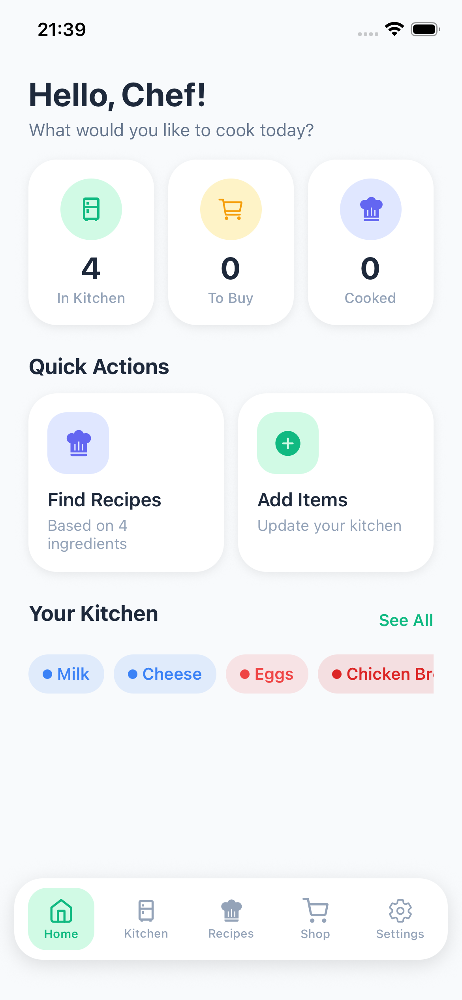

<div align="center">
   

   <h1>🥑 Recipe Fridge</h1>
   <p>
      <b>Modern, beautiful kitchen & recipe manager for home cooks</b><br/>
      <i>Track your fridge, discover recipes, and never waste food again.</i>
   </p>
   <a href="#features"></a>
   <a href="#license"></a>
</div>

---

## ✨ Features

- 🧊 <b>Kitchen Inventory</b>: Manage your fridge, pantry, and freezer with ease
- 🏷️ <b>Smart Categories</b>: Color-coded for Dairy, Meat, Protein, Vegetable, Fruit, Grain, Pantry, Seafood, Frozen, Snack, and more
- ⏰ <b>Expiry Tracking</b>: Instantly see what’s fresh, expiring soon, or expired
- 🍳 <b>Recipe Discovery</b>: Find recipes from TheMealDB & Spoonacular based on your real ingredients
- 📦 <b>Barcode Scanning</b>: Add items in seconds (where supported)
- 🛒 <b>Shopping List</b>: Build and manage your shopping list from missing ingredients
- 🔔 <b>Notifications</b>: Get reminders before food expires
- 🎨 <b>Modern UI</b>: Clean, responsive design with haptics and beautiful category colors

---

## 📸 Screenshots

<p align="center">
   
</p>

---

## 🚀 Getting Started

### 1. Clone the repository

```sh
git clone https://github.com/yourusername/recipe-fridge.git
cd recipe-fridge
```

### 2. Install dependencies

```sh
npm install
# or
yarn
```

### 3. Add your own `app.json`

This project requires an `app.json` file in the root directory for Expo configuration. Here is a template you can use:

```json
{
  "expo": {
    "name": "recipe-fridge",
    "slug": "recipe-fridge",
    "version": "1.0.0",
    "orientation": "portrait",
    "icon": "./assets/icon.png",
    "userInterfaceStyle": "light",
    "splash": {
      "image": "./assets/splash-icon.png",
      "resizeMode": "contain",
      "backgroundColor": "#ffffff"
    },
    "ios": {
      "supportsTablet": true,
      "bundleIdentifier": "com.yourcompany.recipefridge"
    },
    "android": {
      "adaptiveIcon": {
        "foregroundImage": "./assets/adaptive-icon.png",
        "backgroundColor": "#ffffff"
      }
    },
    "web": {
      "favicon": "./assets/favicon.png"
    }
  }
}
```

> **Note:** Replace `bundleIdentifier` and other fields as needed for your own project or Expo account.

### 4. Start the app

```sh
npx expo start
```

- Open in Expo Go (iOS/Android) or use an emulator.

---

## 🗂️ Project Structure

- <b>src/components/</b> – UI components (IngredientCard, RecipeCard, Modals, etc.)
- <b>src/screens/</b> – App screens (Home, Kitchen, Recipes, Shopping, Settings)
- <b>src/context/</b> – Global state (KitchenContext)
- <b>src/services/</b> – API integrations (TheMealDB, Spoonacular, barcode, notifications)
- <b>src/types/</b> – TypeScript types (ingredient, recipe, shopping)
- <b>src/theme/</b> – Colors, spacing, typography
- <b>assets/</b> – Images, icons, screenshots

---

## 🙌 Why Recipe Fridge?

- <b>Save money</b> by using what you have
- <b>Reduce food waste</b> with expiry reminders
- <b>Get inspired</b> with new recipes every day
- <b>Open source</b> and MIT licensed

---

## 📄 License

MIT License. See [LICENSE](LICENSE) for details.

---

<p align="center">
   <i>Made with ❤️ by Dion Jones</i>
</p>
